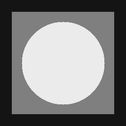

## лабораторная 2

### часть 1 - анализ генерация данных

1. добавьте в библиотеку semcv функцию 
```cpp
cv::Mat gen_tgtimg00(const int lev0, const int lev1, const int lev2)
```
для генерации тестового изображения (серое одноканальное 8bpp) с тремя уровнями яркости (lev0, lev1, lev2)


геометрические размеры:
  * 256 - сторона изображения
  * 209 - сторона внутреннего квадрата
  * 83 - радиус круга
 
2. добавьте в библиотеку semcv функцию для зашумления заданного изображения (серое одноканальное 8bpp) 
```cpp
cv::Mat add_noise_gau(const cv::Mat& img, const int std)
``` 
аддитивным нормальным несмещенным шумом с заданным значением среднеквадратичного отклонения std

3. напишите тестовое консольное приложение task02, которое 
  * генерирует тестовые изображения для 4-х наборов уровней яркости фона-квадрата-круга ([0,127,255], [20,127,235], [55,127,200], [90,127,165])
  * склеивает (по горизонтали) тестовые изображения слева-направо в одно
  * получает зашумленные изображения (склейки) для трех значений std (3, 7, 15)
  * склеивает (по вертикали) исходные и зашумленные в одно
  * сохраняет итоговый результат в файл по указанному в качестве параметра командной строки пути

### часть 2 - анализ результатов

1. рассчитайте статистики для пикселей по однородным областям и проанализуируйте   
  * напишите функцию, которая рассчитывает параметры распределения по маске
  * проведите оценки для всех сгенерированных вариантов и занесите в удобную таблицу
  * сравните с теоретическими и сделайте выводы 

2.  визуализируйте распределения яркости
  * напишите рисователь гистограммы (в квадрате 256x256, максимальная высота отсчета - 250, темные столбцы на светлом фоне, фон можно сделать светло-серым с возможностью управления)
  * сделайте визуализацию гистограмм яркости для всех сгенерированных тестовых изображений
  * склейте визуализации гистограмм в соответствии с положением тестовых примеров (рекомендуется немного варьировать фон гистограмм, например, в шахматном порядке)
    
3. добавьте в тестовое консольное приложение task02, возможность отписать визуализацию гистограмм яркости

### часть 3 - сделайте отчет

